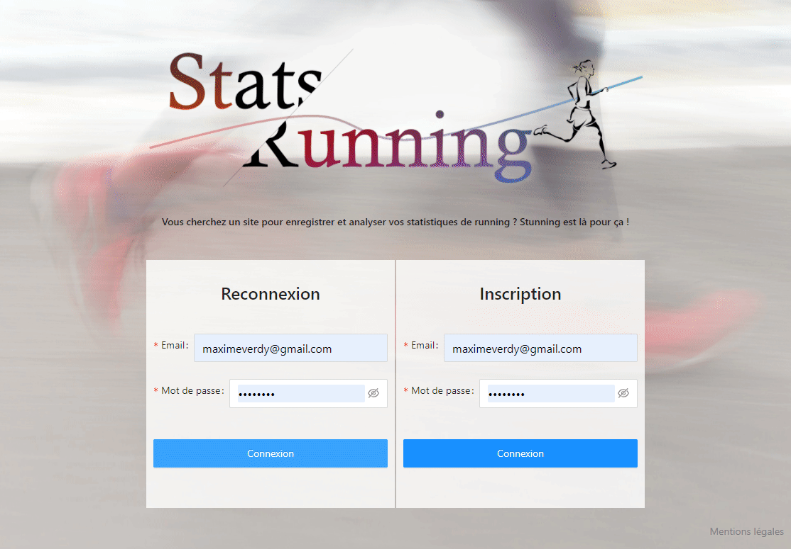

### Stunning est une application React-Redux-Express-MongoDB  
  
*Pour suivre et analyser ses performances en course à pied*  
  
Visitez [Stunning](https://stunning-site.herokuapp.com/)  

  

#### Fonctionnalités et technologies utilisées :  
  
###### En Front :
Le Frontend a été bootstrappé avec Create React App  
Les formulaires, les boutons, partiellement la Navbar sont basés sur Ant Design  
Le state container est basé sur Redux  
La responsivité est faite en CSS  
La navigation se fait avec React Router Dom  
Les tableaux sont fait avec Nivo
  
###### En Back :
Node.js et Express constituent le serveur  
Chiffrement des données sensibles est fait avec crypto-js  

###### En base de données :
La base de données est sur MongoDB  
Les schémas ont été fait avec Mongoose  

###### Test-Driven Development :
TDD effectué avec Jest et Supertest